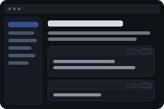

  

# DigitalOcean Studio Setup Guide

  

Didn't work? Create a Mind workspace and paste this to your agent:
` /use-template https://github.com/boweiliu/docean-setup-guide`

## Why you care

Reading a setup guide in a GitHub tab while running its commands in a
terminal means constant tab-switching, and copy-pasting multi-line commands
out of rendered markdown is error-prone. This turns the
[boweiliu/setup-docean-studio](https://github.com/boweiliu/setup-docean-studio)
guide -- running Imbue Studio on your own DigitalOcean droplets -- into a
window with the whole guide on one sidebar and a one-click way to hand any
command to an agent.

## How to use it

Open the app and read down the sidebar in order: an overview, five numbered
runbooks (steps 4a and 4b run in parallel -- wire whichever client you want),
and two decision-log pages explaining what was tried and didn't work. Every
command block has two buttons:

- **Copy** -- puts the command on your clipboard, same as selecting the text.
- **Copy to agent chat** -- drops the command into your open Mind chat,
  unsent, so you can review it and have an agent run or adapt it for you
  instead of retyping it into a terminal yourself.

The Overview page also has a "Run the whole thing" block: one prompt that
tells an agent to run runbooks 01-05 end to end and check each one's Verify
output before moving on, and a "Known issues in this guide" box listing bugs
found in the source repo's scripts while this app was built. The guide itself
stays in sync with GitHub on its own (a background check, plus a "Sync now"
button for an immediate pull) -- nobody has to remember to re-copy anything.

## Ideas for making it yours

- Point it at a different guide entirely: swap the bundled markdown under
  `system/apps/docean_setup_guide/src/docean_setup_guide/assets/docs/`,
  update the `PAGES` list and the `GITHUB_RAW_BASE` constant in `runner.py` --
  the renderer, the sync, the link-rewriting, and the copy /
  copy-to-agent-chat buttons all come along for free.
- Once the upstream guide's known issues are fixed, delete or update the
  `KNOWN_ISSUES` list in `runner.py` so the callout doesn't go stale.
- Add a "mark step done" checkbox per page if you want the app to track your
  progress through the guide, not just render it.
- Swap the dark color scheme for a light one, or make it follow the system
  theme -- it's one `<style>` block in `runner.py`.

## What this is

This repository is a published **minds template**: a clean, bootable
snapshot of what a mind built, ready to adapt into your own. It is NOT the
generic workspace template -- it is this specific project.

[`template.md`](template.md) is the full manifest -- what it is, how it
works, what it needs to run, and what to adapt -- with the
machine-readable half (recipe, requirements, and the environment it needs
installed) in [`template.toml`](template.toml).
